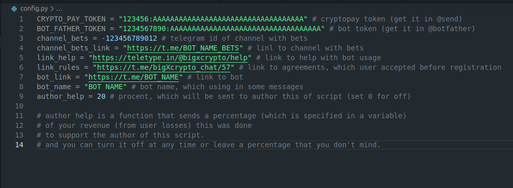
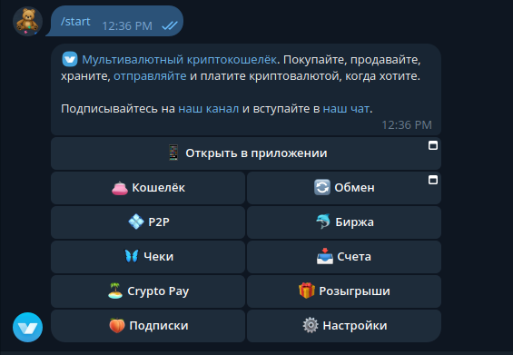
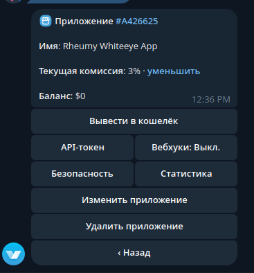
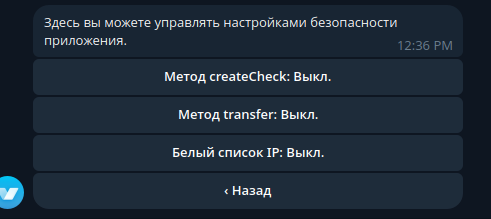
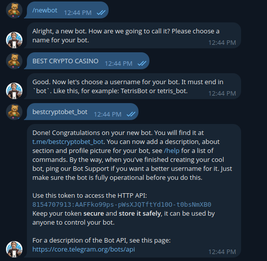
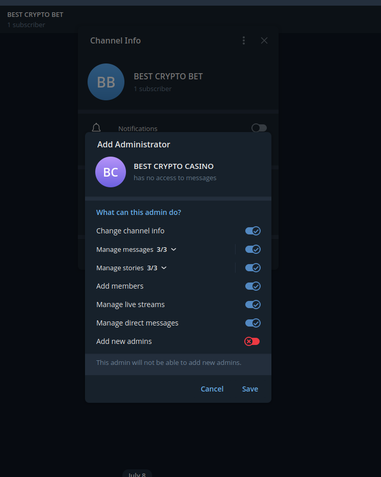

# crypto-casino
### 🇷🇺 RUS: 
Это один из лучших скриптов для крипто-казино в телеграмме,
который изначально писался для моего казино. Оно, кстати, по прежнему работает.

Все сообщения написаны на русском языке, и создавался скрипт для русско-язычной аудитории

## Настройка: ##
__Качаем исходник с помощью git clone:__
> git clone https://github.com/throw-dev/crypto-casino.git

__Расспаковываем в любое место и открываем в терминале__

__Открываем файл config.py в любой удобной ide__

_Тут мы видим 9 настроек:_
1. Токен crypto pay

Начнем с настройки этого токена. Переходим по ссылке [на crypto pay](https://t.me/send) и нажимаем START

Переходим в меню Crypto Pay.

Здесь нам дают возможность создать приложение, давайте сделаем это.

Нам сразу дали возможность настроить это приложение под наши нужды,
но мы будем заниматься только тем, что нужно для запуска бота.

__Переходим в меню безопасность__

_Тут нам нужно включить метод createCheck._

__Затем возвращаемся в меню и переходим в API-Токен__

__Нам осталось только скопировать этот токен и вставить в config.py__

2. Токен бота

__Теперь переходим в бота [botfather](https://t.me/botfather)__
_Тут мы нажимем START и пишем команду /newbot_

__Проходим небольшой опрос и копируем токен бота. Его вставляем в config.py__

3. Создаем телеграм канал.

__Я думаю вам не нужно пояснять, как создать телеграм канал.__

_Добавляем бота в качестве администратора._

__Теперь нужно получить айди каналаю__
_Для этого можно просто переслать сообщение из своего канала в [чат этого бота](https://t.me/FIND_MY_ID_BOT).

### С остальным разберетесь сами, все написано в файле config.py

## Запуск: ##
_p.s. дальнейшие действия выполняются с ubuntu 24.04_

__Возвращаемся в терминал с открытой папкой бота и вводим несколько команд:__

> pip3 install -r requirements.txt --break-system-packages

> python3 main.py

__Теперь можно переходить в вашего бота и играть.__
_В случае проблем обращайтесь в Issues._

## Информация: ##
__Если вы хотите помочь в разработке этого исходника - мы будем рады принять ваши pull requests и любые донаты.

### 🇺🇸 ENG:

This is one of the best scripts for a crypto casino in Telegram,
which was originally written for my casino. It's still working, by the way.

Russian Russian is the language of all messages, and a script has been created for a Russian-speaking audience.

## Setting up: ##
__ Download the source code using git clone:__
> git clone https://github.com/throw-dev/crypto-casino.git

__pack it to any location and open it in the terminal__

__open the config file.py in any convenient ide__

_There we see 9 settings:_
1. The crypto pay token

Let's start by configuring this token. Follow the link [to crypto pay](https://t.me/send ) and click START

Go to the Crypto Pay menu.

Here we are given the opportunity to create an application, let's do it.

We were immediately given the opportunity to customize this application to our needs,
but we will only do what is necessary to launch the bot.

__ Go to the security menu__

Next, we need to enable the createCheck method._

__Then we return to the menu and switch to the API Token__

_All that remains is to copy this token and paste it into config.py__

2. The bot token

__ Now we are switching to the [botfather] bot(https://t.me/botfather )__
_Then we press START and write the command /newbot_

__ We take a small survey and copy the bot token. We insert it into config.py__

3. Create a telegram channel.

_I think you don't need to explain how to create a telegram channel.__

_adding the bot as an administrator._

__You now need to get an ID channel .__
To do this, you can simply forward a message from your channel to [this bot's chat](https://t.me/FIND_MY_ID_BOT ).

### You can figure out the rest yourself, everything is written in the file config.py

## Launch: ##
_p.s. further steps are performed with ubuntu 24.04_

__ Return to the terminal with the bot's folder open and enter a few commands:__

> pip3 install -r requirements.txt --break-system-packages

> python3 main.py

__You can now log into your bot and play.__
_ In case of problems, please contact Issues._

## Information: ##
__If you want to help develop this source code, we will be happy to accept your pull requests and any donations.